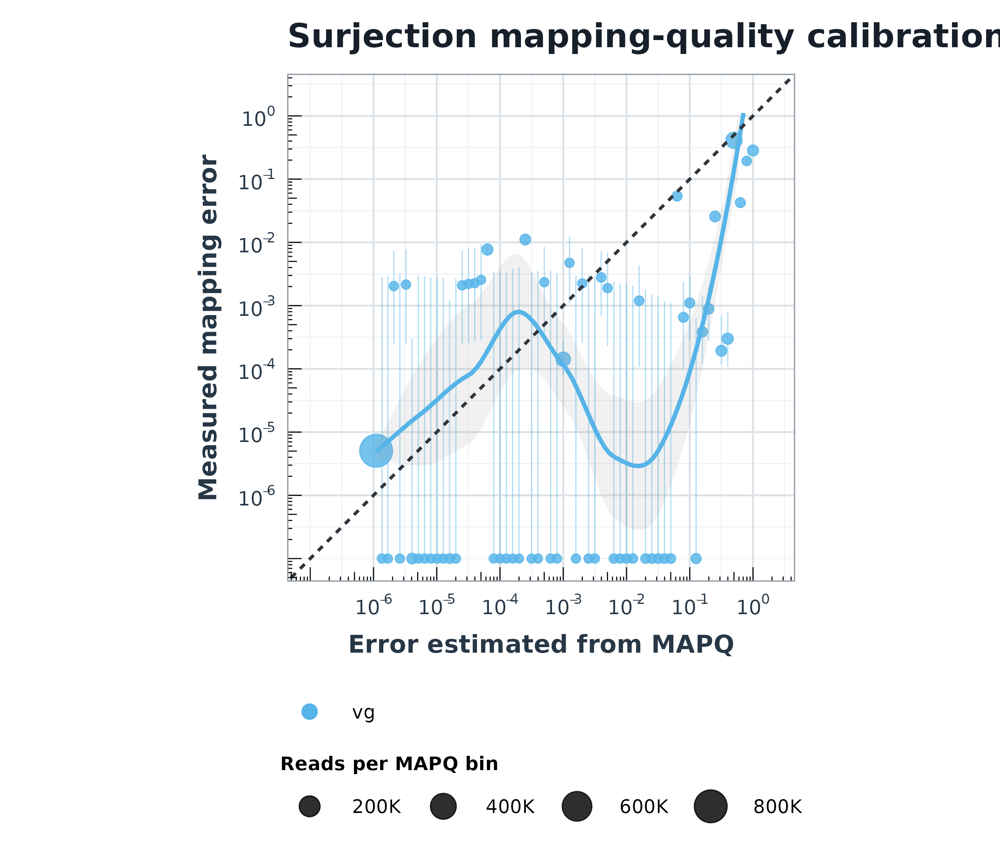
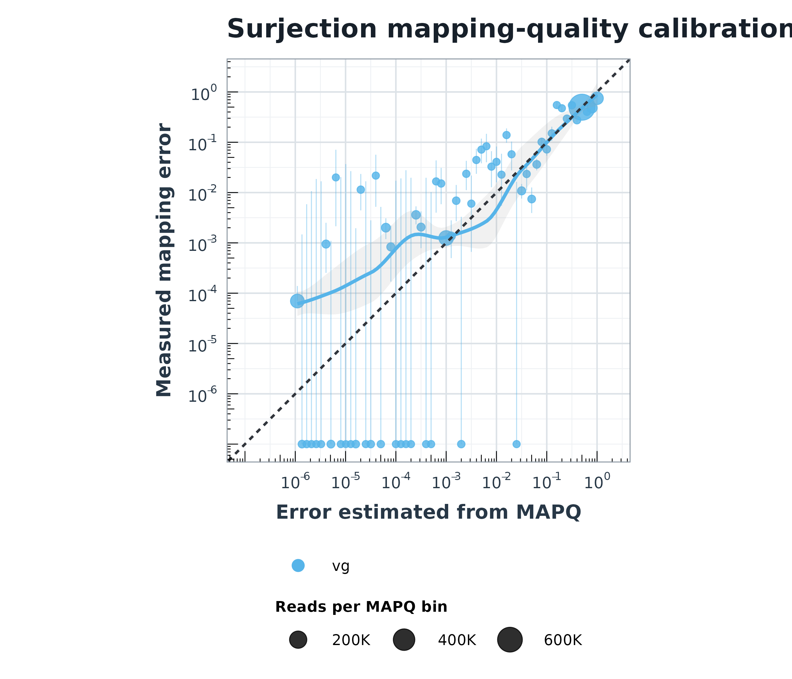

# Haplotype-aware surjection with `vg surject --diploid-map`

This page describes the recent surjection changes, the behavior of
`--diploid-map`, and the validation performed with simulated reads and the
HG002 variant-calling acceptance test.

## Contents

1. [Background](#background)
2. [`--diploid-map`](#--diploid-map)
3. [Paired-end fragment-length learning](#paired-end-fragment-length-learning)
4. [Other recent surjection changes](#other-recent-surjection-changes)
5. [Simulated-read experiments](#simulated-read-experiments)
6. [HG002 acceptance tests](#hg002-acceptance-tests)
7. [Interpretation and limitations](#interpretation-and-limitations)

## Background

Surjection converts a graph alignment in GAM or GAF into an alignment against
one or more embedded linear paths. Ordinary surjection chooses target paths
with `--into-path`, `--into-ref`, or `--into-paths` (`-F`). With `--multimap`,
it can retain a surjection to every selected path instead of reporting only the
best path.

In a diploid graph, a read can overlap both haplotypes of a sample and may also
have multiple graph placements from the mapper. Selecting each record or each
haplotype independently can produce inconsistent primaries and mapping
qualities. `--diploid-map` treats these alternatives as a single competition.

## `--diploid-map`

The option takes an assembly or sample name:

```sh
vg surject \
    --gaf-input \
    --interleaved \
    --diploid-map SAMPLE \
    --bam-output \
    -x graph.gbz \
    mappings.gaf > surjected.bam
```

It has two immediate effects:

1. It selects paths belonging to the named assembly, similarly to
   `--into-ref SAMPLE`.
2. It enables `--multimap`, so competing haplotype-path surjections remain
   available for joint classification.

The input must be grouped by read name (or by fragment for interleaved paired
reads). The primary mapper alignment and its secondary graph placements are
surjected together. For every graph placement, the read is surjected to the
overlapping paths of the requested assembly. Non-supplementary candidates are
then scored together, one overall primary is selected, and the other
candidates are marked secondary.

For single reads, the surjection MAPQ (Global Quality) is calculated from the competing
surjection scores and capped by the MAPQ of the input primary graph alignment.
For paired reads, the same selection is performed over compatible pairs, as
described below.

The output adds these tags:

| Tag | Meaning |
| --- | --- |
| `hp:Z:pri_hap` | Best haplotype-path surjection within an input graph placement. |
| `hp:Z:sec_hap` | Other haplotype-path surjection within that placement. |
| `hq:i` | Quality of the haplotype choice. |
| `aq:i` | MAPQ of the corresponding input graph alignment before surjection. |

Supplementary segments do not compete to become the overall primary.
Disjoint query intervals may still be emitted as supplementary records when
supplementary output is enabled.

## Paired-end fragment-length learning

With `--interleaved --diploid-map`, both ends and all their graph placements
are grouped by fragment. Candidate pairs must surject to the same path on
opposite strands. A pair's template length is calculated on that path.

Pair scoring initially uses the alignment scores of the two ends. The
surjector learns a robust fragment-length distribution from unambiguous pairs
whose two input MAPQs are 60 and whose template length passes
`--max-frag-len`. The current defaults use up to 1,000 observations, reestimate
every 100 observations, and retain the central 95% for robust estimation.
Ambiguous pairs encountered during learning are buffered and replayed after
the distribution is finalized. If learning cannot finish before the buffer
limit, the available estimate is finalized; if no usable distribution exists,
selection falls back to alignment-score-only pairing.

Once trained, the learned fragment-length likelihood is added to the two-end
alignment score. This lets a concordant, plausible insert size help distinguish
otherwise similar haplotype/path combinations. The selected pair's MAPQ is
capped by the lower of the two input MAPQs. If no compatible pair exists, the
ends are classified and emitted as singles.

## Other recent surjection changes

The acceptance-test candidate includes several changes that are independent of
`--diploid-map`:

* `--prune-tail-region` removes anchors lying wholly inside mapper-declared
  left or right tail regions before realignment. Missing tail annotations make
  this operation a no-op.
* Widely separated reference intervals are preserved as distinct candidate
  alignments. Alternatives with substantial query overlap are secondary;
  disjoint alternatives are supplementary when supplementary reporting is
  requested.
* Paths are ranked by their best non-supplementary surjection rather than by
  the first candidate encountered.
* Anchors containing substitutions are realigned instead of being assumed to
  be exact matches.
* Anchor-sliding checks validate the shifted anchor on the actual target path,
  which avoids pruning an anchor based on a duplicate that is not present on
  that path.

Adam's acceptance-test run evaluates these non-diploid changes, principally by
adding `--prune-tail-region` while retaining ordinary reference-path
surjection. The separate diploid Illumina run adds haplotype-aware paired
selection and fragment-distribution learning.

## Simulated-read experiments

The calibration experiments used the KOLF2.1J diploid graph containing the KOLF2.1J haplotypes and CHM13. The HiFi reads were simulated using pbsim2 and Illumina paired-end reads were simulated using ```vg sim```.
### Simulated HiFi reads

One million KOLF2.1J HiFi reads were mapped to the diploid graph with the HiFi
Giraffe preset, recombination-aware mode, and up to five graph placements:

```sh
vg giraffe -b hifi --rec-mode --max-multimaps 5 \
    -Z kolf2.1j-dg-sample.gbz \
    --gam-in KOLF2.1J-sim-hifi-1000000.gam > mapped.gam

vg surject -j -l -P --max-slide 100 \
    --diploid-map KOLF2.1J --bam-output \
    -x kolf2.1j-dg-sample.gbz mapped.gam > surjected.bam
```



The high-MAPQ bins contain very few observed errors, but the curve is
irregular across intermediate MAPQs and several zero-error bins lie at the
plotting floor. The plot therefore supports strong accuracy at the high end,
but does not show uniformly calibrated MAPQ across the full range.

### Simulated paired-end Illumina reads

Five hundred thousand simulated fragments (one million read ends) were mapped
as interleaved reads. Giraffe retained up to five graph placements and
`--diploid-map` jointly selected the paired surjections after learning the
fragment distribution:

```sh
vg giraffe --max-multimaps 5 -i --output-format gaf \
    -Z kolf2.1j-dg-sample.gbz \
    --gam-in truth_p_1M.gam > mapped.gaf

vg surject --gaf-input --interleaved -P --max-slide 100 \
    --diploid-map KOLF2.1J --bam-output \
    -x kolf2.1j-dg-sample.gbz mapped.gaf > surjected.bam
```



After paired-end fragment-distribution learning, the central MAPQ bins track
the ideal diagonal more closely than in the long-read experiment. The lowest
predicted-error bins remain conservative or noisy, which is expected where
there are few observed errors and confidence intervals are wide.

## HG002 acceptance tests

The acceptance workflow maps HG002 reads with Giraffe, surjects the GAF,
calls variants with DeepVariant, and compares calls with the GIAB CHM13 truth
set using Aardvark. Mapping was held to the baseline vg image in all comparisons
so these results isolate candidate surjection behavior. Values below are the
`ALL` row of each Aardvark summary.

### Adam's non-diploid candidate

| Reads | Surjection | FN | FP | Recall | Precision | F1 | Genotype FN | Genotype FP |
| --- | --- | ---: | ---: | ---: | ---: | ---: | ---: | ---: |
| HiFi | Baseline: `--read-length long` | 47,607 | 29,578 | 0.988851279 | 0.993049011 | 0.990945700 | 7,596 | 3,234 |
| HiFi | Candidate: `--read-length long --prune-tail-region` | 47,702 | 29,214 | 0.988829032 | 0.993134247 | 0.990976963 | 7,599 | 3,269 |
| Illumina | Baseline: `--read-length short` | 74,653 | 15,818 | 0.982517582 | 0.996245474 | 0.989333909 | 6,065 | 5,344 |
| Illumina | Candidate: `--read-length short --prune-tail-region` | 74,604 | 15,748 | 0.982529057 | 0.996262025 | 0.989347887 | 6,038 | 5,362 |

For HiFi, the candidate has 364 fewer false positives and 95 more false
negatives, yielding a small F1 increase of 0.0000313. For Illumina, it has 70
fewer false positives and 49 fewer false negatives, yielding an F1 increase of
0.0000140. These are whole-pipeline point estimates; no replicate-based
uncertainty was calculated.

### Diploid Illumina candidate with fragment learning

This run kept the same baseline and mapping image. For the candidate it disabled
`-F` and used:

```text
--read-length long --prune-tail-region --diploid-map CHM13
```

Because the data are marked paired and interleaved, the WDL also supplies
`--interleaved --max-frag-len 3000 --prune-low-cplx`, which activates paired
fragment-distribution learning.

| Run | FN | FP | Recall | Precision | F1 | Genotype FN | Genotype FP |
| --- | ---: | ---: | ---: | ---: | ---: | ---: | ---: |
| Unchanged baseline | 74,648 | 15,818 | 0.982518753 | 0.996245479 | 0.989334505 | 6,065 | 5,343 |
| Diploid candidate | 74,602 | 15,745 | 0.982529526 | 0.996262738 | 0.989348476 | 6,039 | 5,360 |

Relative to its baseline, the diploid candidate has 46 fewer false negatives,
73 fewer false positives, and an F1 increase of 0.0000140. It is essentially
tied with Adam's ordinary Illumina candidate: two fewer false negatives, three
fewer false positives, an F1 increase of about 0.00000059, one more genotype
false negative, and two fewer genotype false positives.

## Interpretation and limitations

The acceptance results show no variant-calling regression and a very small
improvement for the Illumina candidate, but they do not isolate the effect of
fragment learning alone. The diploid candidate simultaneously changes target
paths, enables multimapping and joint haplotype selection, learns fragment
lengths, and uses `--prune-tail-region`.

There is also a preset mismatch in the recorded diploid Illumina input: it uses
`--read-length long`, whereas Adam's Illumina runs use `--read-length short`.
The table reports the run as executed. A controlled follow-up should rerun the
diploid candidate with `--read-length short --prune-tail-region --diploid-map
CHM13` and otherwise identical inputs. Replicates or read-level paired
comparisons would be needed to determine whether differences this small are
statistically meaningful.
