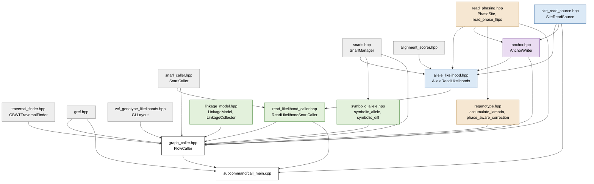

# Read-likelihood caller: a guide to the source

`vg call --read-likelihood` is built from eight modules and one driver class, `FlowCaller` in
`graph_caller.hpp`. A module is a header in `src/` and its `.cpp` file, and is named here by its
header. The source can be read in the order of the method. The method is described in four
documents. [read-likelihood-genotyping.md](read-likelihood-genotyping.md) describes the caller as a
whole and defines the terms of the method used below (site, allele, genotype, ploidy, direct call,
linkage model, strand, phase set, pass, round, level).
[read-likelihood-direct-genotyping.md](read-likelihood-direct-genotyping.md) describes the site
likelihood, [read-likelihood-linkage-model.md](read-likelihood-linkage-model.md) the linkage model,
and [read-likelihood-read-phasing.md](read-likelihood-read-phasing.md) read phasing and
re-genotyping.

The method has four **steps**: site likelihood computation, genotyping, phasing and output
([read-likelihood-genotyping.md](read-likelihood-genotyping.md) describes each). The module map and
the table of modules below group the modules by step.

## How a run is organised

With `--read-likelihood`, nested calling is on by default. The linkage model runs under haplotype
enumeration (the default with a GBZ graph, or `--gbz` or `--gbwt`), when the panel holds at least
two haplotypes and `--linkage-weight` is not 0. When either is on, `FlowCaller` stages each site
and runs the passes and rounds of
[Passes and rounds](read-likelihood-genotyping.md#passes-and-rounds). The calls that start them are
near the end of `main_call` in `subcommand/call_main.cpp`.

1. **Direct pass** (`call_top_level_snarls`, then `call_snarl_internal` for each site). Genotype
   every site directly from its reads, and **stage** it: store its result, and the per-read
   evidence behind it, as a staged site, a `PendingRecord` (see
   [Words the headers use](#words-the-headers-use)). Nested sites are genotyped here
   too, by recursion from their parent, at both ploidy 1 and ploidy 2 when they have more than one
   candidate allele. `record_site` also adds an entry for each genotyped site to the linkage
   model's `LinkageCollector`, except for `retain_only` chains (see below). The direct pass is the
   only pass that fetches reads: the later ones use the per-read evidence it kept.
2. **Round 1.** The linkage pass (`run_linkage_pass`) chooses the genotypes with the linkage model
   and phases them from the panel, one level at a time, parents before children. Between levels it
   sets each child's ploidy from its parent's chosen, phased pair, and swaps in the child's answer
   at that ploidy. Read phasing (`apply_read_phasing`, called from `phase_and_regenotype`), with
   `--read-phasing`, then re-decides the phase from reads that span several sites.
3. **Later rounds** (`phase_and_regenotype`), with `--regenotype`. Each corrects the likelihoods
   from the phase (`apply_regenotyping`), runs the linkage pass again (`rerun_linkage_pass`, which
   rescores the records first), and runs read phasing again. Records that get no line of their own
   (off-reference chains, and chains a parent's block record spells out) keep the likelihoods of
   the direct pass.
4. **Render** (`render_retained_records`). Build each staged site's records from its settled
   genotype, the one the last round chose, add their lines to an output buffer, and collect the
   site's anchors.
5. **Write** (`write_anchors`, then `write_variants`). Write the anchor file, then the VCF: add the
   nesting tags, sort the lines, write the mosaic file, and write each line, rewriting the quality
   fields of records whose genotype the linkage model changed.

Without nested calling and without the linkage model, nothing is staged: the direct pass adds each
record's line to the buffer as soon as its site is genotyped, and the write follows.

The linkage pass keeps each site's chosen pair in `linkage_phased`, which it rebuilds every time it
runs. It fills it only when phasing is written, and it needs it to set a child's ploidy, so where
the linkage model runs, `--no-phased` turns nested calling off. The linkage pass also drops a child
that no allele of its parent's chosen genotype crosses, and can bring back a child that an earlier
linkage pass dropped. A child whose parent has too many candidate alleles to tell which cross it is
never revised or dropped on its parent's account.

Re-genotyping always corrects the likelihoods the direct pass computed, at both ploidies, rather
than those of the previous round. It stops when no record's corrected direct call changes, when a
linkage pass changes no chosen genotype, when the chosen genotypes return to an earlier round's, or
after `--regeno-passes` rounds.

## Module map

An arrow points from a module to a module that includes its header, in its own header or in its
`.cpp` file. `call_main.cpp` also builds objects of other modules, reaching their headers through
these includes. Colour marks the step each module mainly serves; the grey modules are general vg
modules that other callers use too.

Blue: site likelihood computation. Green: genotyping. Orange: phasing. Purple: output. White: the
driver and the command line. `gref.hpp` handles the gRef cover, a set of extra reference paths, and
`vcf_genotype_likelihoods.hpp` the order of the genotypes in a VCF GL field.

`linkage_model.hpp` and `read_phasing.hpp` include no other vg header: they are algorithms over
plain data, and can be read on their own. `graph_caller.cpp` reaches `ReadLikelihoodSnarlCaller`'s
results only through a `dynamic_cast`, so `FlowCaller` also runs vg's other genotypers, and skips
the linkage model and phasing when the cast fails.

## Modules by step

| Step | Module | What it holds |
|---|---|---|
| Site likelihood computation | `site_read_source.hpp` | `SiteRead`, a read as a site sees it, and `SiteReadSource`, which delivers the reads of a site from a GAM or GAF file in memory, an indexed GAM file, a bgzipped GAF file through its tabix index, or a GAF-base database |
| | `allele_likelihood.hpp` | `GraphAlignedAlleleLikelihoodCalculator`, which scores each read against each candidate allele by pairing their node visits, and `AlleleReadLikelihoods`, the resulting matrix of relative likelihoods, which computes $\mathcal{L}(G)$ for each genotype |
| Genotyping | `traversal_finder.hpp` | `GBWTTraversalFinder`, which gives the candidate alleles from the panel, or `FlowTraversalFinder`, under support enumeration |
| | `read_likelihood_caller.hpp` | `ReadLikelihoodSnarlCaller`, which makes one site's direct call from its likelihoods and computes its quality fields |
| | `linkage_model.hpp` | `LinkageModel`, the hidden Markov model over the panel, and `LinkageCollector`, which holds each site's entry and runs the model over linkage chains, one level at a time |
| | `symbolic_allele.hpp` | symbolic alleles and difference blocks, which let a nested site's variation be reported once |
| | `graph_caller.hpp` | the direct pass (`call_snarl_internal`, with nested descent), the linkage pass (`run_linkage_pass`) and the staged sites (`PendingRecord`) |
| Phasing | `linkage_model.hpp` | the Viterbi phase (`LinkageModel::phasing`), recorded by `LinkageCollector` as each site's chosen pair (`PhaseCall`) |
| | `read_phasing.hpp` | per-read evidence (`PhaseReadEvidence`, `PhaseSite`), links between sites, and the decision of each site's order (`read_phase_flips`) |
| | `regenotype.hpp` | strand log-odds, tempering, and the per-read likelihood correction |
| | `graph_caller.hpp` | `phase_and_regenotype`, which applies the two modules above and runs the rounds after the first |
| Output | `graph_caller.hpp` | records (`render_retained_records`, `emit_variant`, `emit_block_records`), sorting and writing (`write_variants`), and the mosaic (`write_mosaic`) |
| | `read_likelihood_caller.hpp` | the VCF fields of a record (`update_vcf_info`) and their header lines |
| | `anchor.hpp` | the anchor file (`build_site_anchors`, `AnchorWriter`) |
| Command line | `subcommand/call_main.cpp` | the options, grouped by subsystem, the `--preset` table, and the construction of every object above |

## Words the headers use

- **Record key.** A hash of the site's ID, the printed snarl: the record's VCF `ID` column, without
  the `_<index>` suffix of a block record. Most tables that follow a site from pass to pass are
  keyed by it.
- **Level.** How deep in the descent a site was genotyped: 0 for a site the direct pass calls as
  top-level (including the children of a snarl it could not genotype), and its parent's level plus
  1 for a site reached by descent. Not `INFO/LV`, and not the gRef level of a contig.
- **Group.** A linkage chain below the top level: the sites of one child chain, at one ploidy, under
  one parent. When the group's ploidy equals its parent's, the parent is the group's first site,
  held at its chosen state. A haploid group under a diploid parent instead starts from the panel
  haplotype that the parent's carrying strand copies.
- **Chosen pair.** A site's chosen genotype as the linkage model phased it, and read phasing may
  then reorder, a `PhaseCall` in
  `linkage_phased`. `LinkageCollector`'s entry keeps the chosen genotype sorted, without phase.
  After the last round it is the settled genotype, the one written.
- **Nested strand.** The strand of its parent on which a ploidy-1 child lies
  (`PhaseCall::nested_strand`).
- **Crossing mask.** For each child, which of the parent's candidate alleles cross it, one bit per
  allele; it is unknown when the parent has more candidates than the mask has bits.
- **Moved.** A site whose chosen genotype in the last linkage pass differs from its direct call
  (under re-genotyping, the best genotype of its corrected likelihoods). Its records get the moved
  quality fields (see the state table).
- **Staged site (`PendingRecord`).** One site's result from the direct pass: the snarl, its
  candidate alleles, its direct call and its ploidy, its `CallInfo` (see the state table), and its
  place in the nesting tree (parent, chain, level, crossing mask). Three containers hold staged
  sites. The direct pass puts nested sites in `pending_records` and top-level sites in
  `render_records`; the first linkage pass moves the nested ones to `deferred_pending`; the
  render's **hand-off** (`hand_off_deferred_records`) moves the nested sites the linkage pass kept
  into `render_records` when they get a line, and collects anchors for those that do not. The
  code's pending, deferred, retained and render records are all staged sites.
- **`retain_only`.** Under the linkage model, a child site that no allele of its parent's direct
  call crosses, and the sites nested in it. It is genotyped and staged, but gets no entry in
  `LinkageCollector` and no line, unless a linkage pass finds that the parent's chosen genotype
  crosses it. (Without the linkage model such a site is not genotyped at all.) A site with no
  reference path gets an entry anyway. A linkage pass does not drop a `retain_only` site on its
  parent's account when the parent has no chosen pair, when the crossing mask is unknown or empty,
  or when the direct pass has no answer at the chosen ploidy; such a site is written. A dropped
  ancestor still removes it.
- **Linkage pass and round.** A linkage pass chooses the genotypes of every level once. Round 1 is
  a linkage pass and read phasing; each later round corrects the likelihoods first.
- **Nested.** Four senses:
  - **nested calling**, the descent into child chains in `call_snarl_internal` (`--nested`, turned
    on in the code by `VCFOutputCaller::set_symbolic_collapsing`);
  - `FlowCaller`'s constructor flag `nested`, which is `--top-down`;
  - `set_nested` and `include_nested`, which write the nesting INFO tags (`LV`, `PS`, `CH`, ...),
    under `--all-snarls`, `--top-down`, `--bottom-up` or off-reference nesting;
  - `SiteContext::nested`, which marks a site with one copy under its parent.

  `PS` names both a nesting INFO tag and `FORMAT/PS`, the phase set.

## State carried between passes

| State | Written by | Read by |
|---|---|---|
| `PendingRecord` (in `render_records`, `pending_records`, `deferred_pending`) | the direct pass | the linkage pass, the render |
| `ReadLikelihoodCallInfo`, one per site: every genotype's likelihood, the quality fields, the per-read evidence, and the answer at the other ploidy | `ReadLikelihoodSnarlCaller::genotype`, in the direct pass; the linkage pass exchanges it with the other ploidy's answer; re-genotyping corrects both | the linkage pass, the later rounds, the render |
| `LinkageCollector` entries | the direct pass (`record_site`); the linkage pass retracts an entry and records it again when it changes a child's ploidy, and records a child it brings back; re-genotyping replaces the likelihoods and direct call of each corrected record's entry (`rescore`); the render records whether each site got a line and, for a whole-site record, how each allele was written (`set_allele_map`) | the linkage pass; the render (`settled_traversals`); the write |
| `linkage_phased`, the chosen pair (`PhaseCall`) of each site | the linkage pass, rebuilt by every linkage pass; read phasing swaps pairs in place | the linkage pass (parents), re-genotyping (nested strands), the render, through `render_phases`, a copy keyed by record that `build_render_phases` makes, and `write_mosaic` |
| `phase_sites`, `phase_flips` | `apply_read_phasing` | re-genotyping; `build_render_lambda`, for the anchors |
| the temper, and `render_lambda` | re-genotyping fits the temper once, from round 1's read phase, before the first correction; `build_render_lambda` uses it, or fits its own when re-genotyping did not, and computes the strand log-odds the anchors use | the anchors |
| `moved_quality`, the linkage model's posterior of each moved site's chosen genotype, and its explained share | the linkage pass | `write_variants`, which rewrites `GQ` from it and recomputes `GQN` and `FILTER` from the line's `GL`; the anchors, to test whether a record moved |

## Reading order

Read the headers in this order. The glossary above covers the words that appear before the header
that explains them.

1. **`graph_caller.hpp`, the class comment of `FlowCaller` only,** and the end of `main_call` in
   `subcommand/call_main.cpp`, where the passes are called. They give the rest a frame. The rest of
   `graph_caller.hpp` is item 9.
2. **`site_read_source.hpp`.** Which reads a site gets, and the three places they come from. The
   details of the backends and their caches can be skimmed.
3. **`allele_likelihood.hpp`.** The site likelihood. Read `AlleleReadLikelihoods` first: one site's
   matrix of relative likelihoods, the mismapping probabilities, the mixture weights and the depth
   term, from which it computes $\mathcal{L}(G)$ for a genotype. Then
   `GraphAlignedAlleleLikelihoodCalculator`, which builds the matrix by pairing each read's node
   visits with each allele's, and `AlleleLikelihoodParams`, its settings. The header includes
   `anchor.hpp` and `read_phasing.hpp`, because the calculator also keeps each read's evidence for
   those two modules while the read is at hand; their types can be skipped until items 6 and 8.
4. **`snarl_caller.hpp` (`SnarlCaller` and `SupportBasedSnarlCaller` only), then
   `read_likelihood_caller.hpp`.** `ReadLikelihoodSnarlCaller` subclasses `SupportBasedSnarlCaller`,
   because `FlowCaller` is built with one. It turns one site's matrix into a direct call. Its
   `genotype` returns the genotype, and beside it a `ReadLikelihoodCallInfo` (see the state table).
5. **`linkage_model.hpp`.** `LinkageModel` first: sites, states, emissions and transitions, then
   `posteriors` and `phasing`. Then `LinkageCollector`, which holds an entry for each site, added
   during the direct pass. In the linkage pass it runs the model over top-level linkage chains and
   groups one level at a time, recording each site's chosen pair. `LinkageCounters` last.
6. **`read_phasing.hpp`.** The evidence each read gives at a phaseable site, links between sites,
   and the four stages that decide each site's order. It also declares `allele_length_weights`,
   which `regenotype.cpp` and `anchor.cpp` use too.
7. **`regenotype.hpp`.** How a read's evidence at the other phaseable sites becomes per-read
   weights, built from the allele-length weights, and the correction to the likelihoods.
8. **`anchor.hpp`.** Pins, slots and anchors, and the file that records them.
9. **`symbolic_allele.hpp`, then the rest of `graph_caller.hpp`.** `symbolic_allele.hpp` compares a
   parent site's allele with the reference allele when its differences lie inside child chains, and
   cuts it into difference blocks. In `graph_caller.hpp`, read `VCFOutputCaller` (the output, and
   the linkage, phasing and anchor settings) and `FlowCaller` (the passes); skip `VCFGenotyper`,
   `LegacyCaller`, `NestedFlowCaller`, `SnarlGraph` and `GAFOutputCaller`, which serve vg's other
   genotypers. Entry points, in pass order:
   - the direct pass: `call_snarl_internal`, `record_site`, `stage_render_record`, `PendingRecord`;
   - the linkage pass: `run_linkage_pass`, `resolve_linkage_level`;
   - read phasing and the later rounds: `phase_and_regenotype`, `apply_read_phasing`,
     `apply_regenotyping`, `rerun_linkage_pass`;
   - the render: `render_retained_records`, which first calls `build_render_lambda`,
     `build_render_phases` and `hand_off_deferred_records`, then, for each record,
     `chosen_genotype_for`, `collect_anchors_for_record` and `emit_variant`;
   - the write: `write_anchors`, then `write_variants`, which calls `finalise_linkage_outputs`
     and through it `write_mosaic`.
10. **`subcommand/call_main.cpp`.** The option table, and how each option reaches the objects above.

The `.cpp` files follow the same order, and `traversal_finder.hpp` can be read whenever the
candidate alleles need explaining. Each module has unit tests in `src/unittest/<module>.cpp`, and
`allele_likelihood.hpp` has a second file of them, `allele_likelihood_scoring.cpp`.
`test/t/18_vg_call.t` tests the whole command.

## Where the code departs from this order

- `allele_likelihood.hpp` fills two types that belong to later modules, the anchor evidence and
  the phase evidence, because only it has each read's alignment in hand. Under `--anchors-out` it
  keeps only the anchor evidence, and the phase evidence is derived from it by
  `ReadLikelihoodCallInfo::read_phasing_evidence`, declared in `read_likelihood_caller.hpp`.
- `allele_length_weights` is declared in `read_phasing.hpp` but is also used by `regenotype.cpp`
  and `anchor.cpp`.
- `linkage_model.hpp` holds two concepts, the model (`LinkageModel`) and the code that drives it
  over the snarl tree (`LinkageCollector`).
- `graph_caller.hpp` holds the passes and the output. Most of the read-likelihood state lives on
  `VCFOutputCaller`, a base class that vg's other callers share, although only `FlowCaller` uses it.
- `call_main.cpp` constructs `GraphAlignedAlleleLikelihoodCalculator` and `LinkageCollector` itself.
- `--anchors-out` changes more than the output. It turns on the genotyping of off-reference chains,
  which adds groups and sites to read phasing, so the written phase can change, and under
  `--regenotype` genotypes too. The environment variable `VG_CALL_NO_REF_NESTED` turns that
  genotyping on by itself, for testing.
