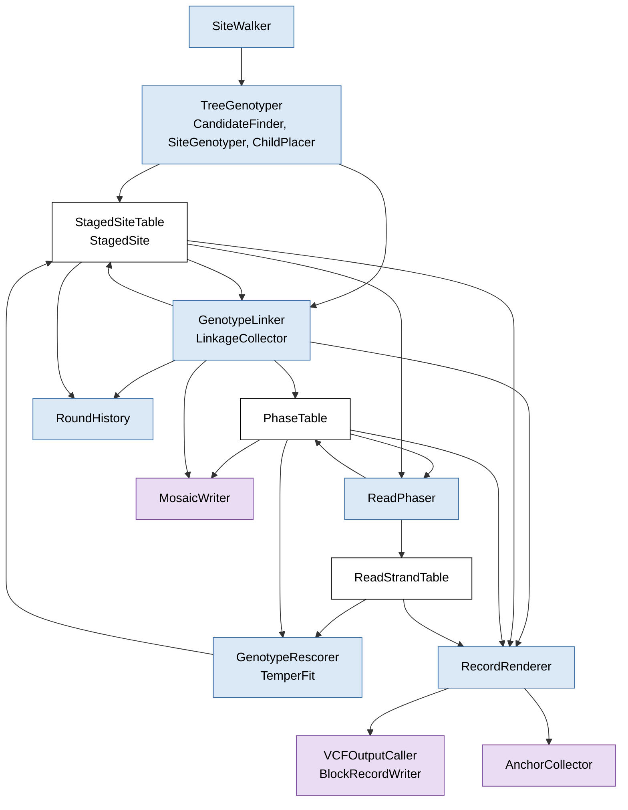

# Read-likelihood caller: a guide to the source

`vg call --read-likelihood` runs through one driver class, `MultiPassCaller` in
`multipass_caller.hpp`, and the classes it holds. A module is a header in `src/` and its `.cpp`
file, and is named here by its header. The classes that run the caller's passes, from
`MultiPassCaller` down, are in namespace `vg::multipass`. The modules they call are in namespace
`vg`: the genotyper, the likelihood calculation and read source, the linkage model, read phasing,
re-genotyping, the symbolic layer and the anchors, and the modules vg's other callers share, such
as the VCF output and the candidate search.

The method is described in four documents.
[read-likelihood-genotyping.md](read-likelihood-genotyping.md) describes the caller as a whole and
defines the terms of the method used below (site, allele, genotype, ploidy, direct call, linkage
model, strand, phase set, pass, round, level).
[read-likelihood-direct-genotyping.md](read-likelihood-direct-genotyping.md) describes the site
likelihood, [read-likelihood-linkage-model.md](read-likelihood-linkage-model.md) the linkage model,
and [read-likelihood-read-phasing.md](read-likelihood-read-phasing.md) read phasing and
re-genotyping.

## The driver

For every `--read-likelihood` run, `main_call` in `subcommand/call_main.cpp` builds five objects
and hands them to `MultiPassCaller`:

- the sites, a `SnarlManagerDecomposition` over the snarls it loaded or computed, which
  `MultiPassCaller` reads only through the `SnarlDecomposition` interface;
- the candidate search, a `TraversalFinder`: `GBWTTraversalFinder`, which takes the candidate
  alleles from the panel's haplotypes, or `FlowTraversalFinder` under support enumeration;
- the genotyper, a `ReadLikelihoodSnarlCaller`, with the likelihood calculator and read source it
  uses;
- the output, a plain `VCFOutputCaller`, used as a buffer of records;
- the linkage model's `LinkageCollector`, when the linkage model runs.

`main_call` then sets the caller's options through its setters and calls `MultiPassCaller::call()`
once. `call()` runs every pass, adds the records to the output's buffer, and writes the anchor
file and the mosaic. `main_call` finally writes the VCF with `VCFOutputCaller::write_variants`,
which adds the nesting INFO tags where they are written, sorts the records and writes them.

## How a run is organised

`call()` runs the passes and rounds of
[Passes and rounds](read-likelihood-genotyping.md#passes-and-rounds) in this order.

1. **Direct pass.** `SiteWalker` walks the sites of the decomposition, every top-level site in
   parallel; with a windowed read source, it batches them by node ID, so that the source's cache
   serves neighbouring sites. For each one, `TreeGenotyper::genotype` finds the site's candidate
   alleles and reference path (`CandidateFinder`), genotypes it from its reads (`SiteGenotyper`),
   files it with the linkage model (`GenotypeLinker::add`), and **stages** it in the
   `StagedSiteTable`. With nested calling, `ChildPlacer` then lists the child chains the called
   alleles cross, each with its place in the nesting tree, and `TreeGenotyper` genotypes and
   stages each child in the same way, at both ploidy 1 and ploidy 2 when it has more than one
   candidate allele. Under the linkage model it also genotypes and stages the chains no called
   allele crosses (see "retained only" below), and, with off-reference genotyping on, the chains
   off the reference. The direct pass is the only pass that fetches reads; the later ones use the
   per-read evidence it staged, and `main_call` frees the read source's cache once it ends.
2. **Round 1.** The linkage pass (`GenotypeLinker::link`) has the linkage model choose the
   genotypes one level at a time, parents before children, and, when phasing is written, writes
   each site's phase to the `PhaseTable`. Between levels it sets each child's ploidy from its
   parent's chosen pair and swaps in the child's answer at that ploidy. After each linkage pass,
   `MultiPassCaller` tests again, through `BlockRecordWriter`, which chains a parent's block
   record already spells, so that no chain is written twice. Read phasing (`ReadPhaser::phase`),
   when it is on, then re-decides the phase from reads that span several sites: it swaps strands
   in the `PhaseTable` and fills the `ReadStrandTable`.
3. **Later rounds**, with re-genotyping. Each round corrects every staged site's likelihoods from
   the phase (`GenotypeRescorer::rescore`), gives the corrected likelihoods to the linkage model
   (`GenotypeLinker::resync`), runs the linkage pass again, and runs read phasing again.
   `RoundHistory` keeps a digest of each round's chosen genotypes, so that `call()` can tell when
   the rounds converge or cycle. With one pass the correction is computed and reported, and not
   applied.
4. **Render.** `MultiPassCaller` sums each read's strand log-odds for the anchors
   (`ReadStrandTable::build_lambda`) and freezes the phase (`PhaseTable::freeze_for_render`).
   `RecordRenderer::render` then hands the nested sites that get a line of their own to the render
   queues, builds each queued site's records once, from its chosen genotype, through
   `VCFOutputCaller::emit_variant`, and collects each site's anchors.
5. **Files and reports.** Write the anchor file (`AnchorCollector`) and the mosaic
   (`MosaicWriter`), and report the linkage, phasing, mosaic and block counts.

Every mode is this sequence with parts switched off. Without a panel, `GenotypeLinker` has no
collector and chooses nothing: each nested chain keeps the ploidy the direct pass gave it from its
parent's direct call, and read phasing and re-genotyping do not run. Where the linkage model runs
but phasing is not written (`--no-phased`), the `PhaseTable` stays empty, so read phasing and
re-genotyping do nothing, and nested calling is off. Without nested calling, `ChildPlacer` lists
no children. By default, `SiteWalker` walks the children of a top-level site that cannot be
genotyped as top-level sites; `--all-snarls` makes it walk the children of every site, and turns
nested calling off. `--top-down` makes `TreeGenotyper` genotype each child against the traversals
its parent's called alleles allow, and `SiteWalker` walk no children.

The linkage pass drops a child that no allele of its parent's chosen genotype crosses, and can
bring back a child that an earlier linkage pass dropped. A child whose parent has too many
candidate alleles to tell which cross it is never revised or dropped on its parent's account.

Re-genotyping always corrects the likelihoods the direct pass computed, at both ploidies, rather
than those of the previous round. It stops when no site's corrected direct call changes, when a
linkage pass changes no chosen genotype, when the chosen genotypes return to an earlier round's,
or after `--regeno-passes` rounds.

## Data flow

An arrow points from a class to the data it writes, or from data to the class that reads it. The
widgets are blue, the data structures they share are white, and the outputs are purple.

`MultiPassCaller` holds every box and calls the widgets in the order above, and some widgets
call others they are given. `TreeGenotyper` uses the classes named in its box. `ChildPlacer` asks
`BlockRecordWriter` which chains a block record spells. `RecordRenderer` reads the chosen
genotypes and the moved quality from `GenotypeLinker`, builds records through the output, and
hands anchors to `AnchorCollector`. The linker, the rescorer and the renderer read each staged
site's score through a `SiteReader` that `MultiPassCaller` gives them, and `resync` gives the
linkage model the scores the rescorer corrected.

## Modules by step

The method has four steps: site likelihood computation, genotyping, phasing and output
([read-likelihood-genotyping.md](read-likelihood-genotyping.md) describes each). The modules are
grouped by the step they serve; the driver and its walk come first.

| Step | Module | What it holds |
|---|---|---|
| Driver | `multipass_caller.hpp` | `MultiPassCaller`, which holds the options and the widgets, and runs the passes in `call()` |
| | `site_walker.hpp`, `site_scheduler.hpp` | `SiteWalker`, the walk over a decomposition's sites, and the batching scheduler it shares with `GraphCaller` |
| | `site_values.hpp` | the plain values a site is described by (`SiteView`, `SiteChildren`, `ChildSite`), and conversions from `Snarl` and `SnarlTraversal` |
| | `staged_site.hpp` | `StagedSite`, one site's result from the direct pass, and `StagedSiteTable`, which holds every staged site from the direct pass to the render |
| Site likelihood computation | `site_read_source.hpp` | `SiteRead`, a read as a site sees it, and `SiteReadSource`, which delivers the reads of a site from a GAM or GAF file in memory, an indexed GAM file, a bgzipped GAF file through its tabix index, or a GAF-base database |
| | `allele_likelihood.hpp` | `GraphAlignedAlleleLikelihoodCalculator`, which scores each read against each candidate allele by pairing their node visits, and `AlleleReadLikelihoods`, the resulting matrix of relative likelihoods, which computes $\mathcal{L}(G)$ for each genotype |
| Genotyping | `candidate_finder.hpp` | `CandidateFinder`, which finds a site's reference path and candidate alleles; `FlowCaller` uses it too |
| | `read_likelihood_caller.hpp`, `site_genotyper.hpp` | `ReadLikelihoodSnarlCaller`, which makes one site's direct call from its likelihoods and computes its quality fields, and `SiteGenotyper`, which calls it with explicit ploidies and returns a typed `SiteScore` |
| | `tree_genotyper.hpp`, `child_placer.hpp` | `TreeGenotyper`, the direct pass for one top-level site and the sites below it, and `ChildPlacer`, which lists the child chains a site's called alleles cross, each with its `NestingPlacement` |
| | `linkage_model.hpp`, `genotype_linker.hpp` | `LinkageModel`, the hidden Markov model over the panel; `LinkageCollector`, which holds each site's entry, runs the model over linkage chains one level at a time, and keeps each site's chosen genotype; and `GenotypeLinker`, the linkage pass, which files the staged sites with the collector and revises each nested staged site from its parent's chosen genotype |
| | `panel_lookup.hpp`, `ploidy_regions.hpp` | `PanelLookup`, which finds the panel haplotypes that carry an allele, and `PloidyRegions`, the ploidy of each region |
| Phasing | `phase_table.hpp` | `PhaseTable`, the chosen pair of every phased site, which the linkage pass fills and read phasing reorders |
| | `read_phasing.hpp`, `read_phaser.hpp` | per-read evidence (`PhaseReadEvidence`, `PhaseSite`), links between sites, and the decision of each site's order (`read_phase_flips`); and `ReadPhaser`, which applies that decision to the `PhaseTable` |
| | `read_strand_table.hpp` | `ReadStrandTable`, what read phasing decided about each site's reads, and `TemperFit`, the temper fitted in the first re-genotyping round |
| | `regenotype.hpp`, `genotype_rescorer.hpp`, `round_history.hpp` | strand log-odds, tempering and the per-read likelihood correction; `GenotypeRescorer`, which applies the correction to every staged site; and `RoundHistory`, the chosen genotypes of each round |
| Output | `record_renderer.hpp` | `RecordRenderer`, which builds each staged site's records once and collects its anchors |
| | `vcf_output_caller.hpp`, `vcf_record.hpp` | `VCFOutputCaller`, the record buffer and VCF writer that vg's callers share, and `build_site_record`, which builds one site's record from its alleles and the steps a caller adds |
| | `symbolic_allele.hpp`, `block_records.hpp` | symbolic alleles and difference blocks, which let a nested site's variation be reported once, and `BlockRecordWriter`, which writes a site as its difference blocks |
| | `anchor.hpp`, `mosaic_writer.hpp` | the anchor file (`AnchorCollector`, `AnchorWriter`) and the mosaic file (`MosaicWriter`) |
| Command line | `subcommand/call_main.cpp` | the options, grouped by subsystem, the `--preset` table, and the construction of every object above |

## Words the headers use

- **Record key.** A hash of the site's ID, the printed snarl: the record's VCF `ID` column, without
  the `_<index>` suffix of a block record. Most tables that follow a site from pass to pass are
  keyed by it.
- **Level.** How deep in the descent a site was genotyped: 0 for a site the direct pass calls as
  top-level (including the children of a snarl it could not genotype), and its parent's level plus
  1 for a site reached by descent. Not `INFO/LV`, and not the gRef level of a contig.
- **Group.** A linkage chain below the top level: the sites of one child chain, at one ploidy, under
  one parent. When the group's ploidy equals its parent's, the parent is the group's first site,
  held at its chosen state. A haploid group under a diploid parent instead starts from the panel
  haplotype that the parent's carrying strand copies.
- **Chosen pair.** A site's chosen genotype as the linkage model phased it, and read phasing may
  then reorder: a `PhaseCall` in the `PhaseTable`. `LinkageCollector`'s entry keeps the chosen
  genotype sorted, without phase. After the last round it is the genotype written.
- **Nested strand.** The strand of its parent on which a ploidy-1 child lies
  (`PhaseCall::nested_strand`).
- **Crossing mask.** For each child, which of the parent's candidate alleles cross it, one bit per
  allele; it is unknown when the parent has more candidates than the mask has bits.
- **Moved.** A site whose chosen genotype in the last linkage pass differs from its direct call
  (under re-genotyping, the best genotype of its corrected likelihoods). Its records get quality
  fields for the chosen genotype (see the state table).
- **Staged site (`StagedSite`).** One site's result from the direct pass: its bounds, candidate
  alleles, direct call, ploidy and score (see the state table), and its place in the nesting tree
  (parent, chain, level, crossing mask). The `StagedSiteTable` keeps top-level sites in render
  queues and nested sites in one list, which every linkage pass revises in place. The render's
  **hand-off** moves the nested sites that get a line of their own into the render queues, and
  collects anchors for those that do not.
- **Retained only.** Under the linkage model, a child site that no allele of its parent's direct
  call crosses, and the sites nested in it. It is genotyped and staged, but gets no entry in
  `LinkageCollector` and no line, unless a linkage pass finds that the parent's chosen genotype
  crosses it. (Without the linkage model such a site is not genotyped at all.) A site with no
  reference path gets an entry anyway. A linkage pass does not drop such a site on its parent's
  account when the parent has no chosen pair, when the crossing mask is unknown, or when the
  direct pass has no answer at the chosen ploidy; such a site is written. A dropped ancestor
  still removes it.
- **Linkage pass and round.** A linkage pass chooses the genotypes of every level once. Round 1 is
  a linkage pass and read phasing; each later round corrects the likelihoods first.
- **Nested.** Three senses:
  - **nested calling**, the descent into child chains in the direct pass
    (`MultiPassCaller::set_nested_calling`);
  - `set_nested` and `include_nested` on `VCFOutputCaller`, which write the nesting INFO tags
    (`LV`, `PS`, `CH`, ...);
  - `NestingPlacement`, a site's place under its parent.

  `PS` names both a nesting INFO tag and `FORMAT/PS`, the phase set.

## State carried between passes

| State | Written by | Read by |
|---|---|---|
| `StagedSite`s, in the `StagedSiteTable` | the direct pass; every linkage pass revises the nested sites' ploidy, genotype and score (the direct pass's answer at the new ploidy), crossing masks, dropped flag and offsets, and which chains a block record spells | the linkage pass, read phasing, re-genotyping, the render |
| `SiteScore`, one per staged site: every genotype's likelihood, the quality fields, the per-read evidence, and the answer at the other ploidy | `SiteGenotyper`, in the direct pass; the linkage pass exchanges it with the other ploidy's answer; re-genotyping corrects both | the linkage pass, the later rounds, the render |
| `LinkageCollector` entries | the direct pass (`GenotypeLinker::add`); the linkage pass retracts an entry and records it again when it changes a child's ploidy, and records a child it brings back; re-genotyping replaces the likelihoods and direct call of each corrected site's entry (`GenotypeLinker::resync`); the render records whether each site got a line and how each allele was written | the linkage pass, the render, the mosaic |
| `PhaseTable`, the chosen pair (`PhaseCall`) of each site | every linkage pass rebuilds it; read phasing swaps pairs in place; the render freezes a copy keyed by record | the linkage pass (parents), re-genotyping (nested strands), the render, the mosaic |
| `ReadStrandTable`: each phased site's reduced read evidence, the sites whose order read phasing reversed, and each read's strand log-odds | `ReadPhaser`; before the render, `build_lambda` sums each read's strand log-odds | re-genotyping; the render, for the anchors |
| `TemperFit`, the temper and its calibration table | the first re-genotyping round | the later rounds; the render, for the anchors' strand log-odds |
| moved quality: the linkage model's posterior of each moved site's chosen genotype, and the direct call's quality inputs | the linkage pass | the render, which gives each moved site's records `GQ`, `GQN` and `FILTER` for the chosen genotype; the anchors |

## Reading order

Read the headers in this order. The glossary above covers the words that appear before the header
that explains them.

1. **`multipass_caller.hpp`, the class comment of `MultiPassCaller` and `call()`,** and the end of
   `main_call` in `subcommand/call_main.cpp`, where the caller is built and called. They give the
   rest a frame.
2. **`site_read_source.hpp`.** Which reads a site gets, and the places they come from. The details
   of the backends and their caches can be skimmed.
3. **`allele_likelihood.hpp`.** The site likelihood. Read `AlleleReadLikelihoods` first: one site's
   matrix of relative likelihoods, the mismapping probabilities, the mixture weights and the depth
   term, from which it computes $\mathcal{L}(G)$ for a genotype. Then
   `GraphAlignedAlleleLikelihoodCalculator`, which builds the matrix by pairing each read's node
   visits with each allele's, and `AlleleLikelihoodParams`, its settings. The header includes
   `anchor.hpp` and `read_phasing.hpp`, because the calculator also keeps each read's evidence for
   those two modules while the read is at hand; their types can be skipped until items 8 and 10.
4. **`read_likelihood_caller.hpp`, then `site_genotyper.hpp`.** `ReadLikelihoodSnarlCaller` turns
   one site's matrix into a direct call, and `SiteGenotyper` gives it its ploidies and returns the
   `SiteScore` the later passes read.
5. **`site_values.hpp`, `site_walker.hpp`, `candidate_finder.hpp`, `child_placer.hpp` and
   `tree_genotyper.hpp`.** The direct pass: how the sites are walked, how a site's candidates are
   found, how its children are placed, and how each is genotyped and staged.
6. **`staged_site.hpp`.** What the direct pass keeps for each site, and the orders in which the
   later passes visit the staged sites.
7. **`linkage_model.hpp`, then `genotype_linker.hpp` and `phase_table.hpp`.** `LinkageModel`
   first: sites, states, emissions and transitions, then `posteriors` and `phasing`. Then
   `LinkageCollector`, which holds an entry for each site and runs the model over top-level
   linkage chains and groups one level at a time. Then `GenotypeLinker`, the linkage pass, and the
   `PhaseTable` it fills.
8. **`read_phasing.hpp`, then `read_phaser.hpp` and `read_strand_table.hpp`.** The evidence each
   read gives at a phaseable site, links between sites, and the four stages that decide each
   site's order. `read_phasing.hpp` also declares `allele_length_weights`, which `regenotype.cpp`
   and `anchor.cpp` use too.
9. **`regenotype.hpp`, then `genotype_rescorer.hpp` and `round_history.hpp`.** How a read's
   evidence at the other phaseable sites becomes per-read weights, and the correction to the
   likelihoods; then how the rounds apply it and decide when to stop.
10. **`anchor.hpp`.** Pins, slots and anchors, and the file that records them.
11. **`symbolic_allele.hpp`, `block_records.hpp` and `record_renderer.hpp`, then
    `vcf_output_caller.hpp` and `vcf_record.hpp`.** `symbolic_allele.hpp` compares a parent
    site's allele with the reference allele when its differences lie inside child chains, and cuts
    it into difference blocks, which `BlockRecordWriter` writes. `RecordRenderer` builds each
    staged site's records through `VCFOutputCaller::emit_variant`, with the steps
    `MultiPassCaller::record_steps` adds. In `vcf_output_caller.hpp`, skip what serves only vg's
    other callers.
12. **`mosaic_writer.hpp`,** the mosaic file, and **`subcommand/call_main.cpp`,** the option table
    and how each option reaches the objects above.

The `.cpp` files follow the same order, and `traversal_finder.hpp` can be read whenever the
candidate alleles need explaining. Unit tests are in `src/unittest/<module>.cpp` for
`multipass_caller`, `site_walker`, `site_read_source`, `allele_likelihood` (with a second file,
`allele_likelihood_scoring.cpp`), `read_likelihood_caller`, `linkage_model`, `read_phasing`,
`regenotype`, `symbolic_allele` and `anchor`; `ChildPlacer` and `PhaseTable` are tested in
`graph_caller.cpp`. `test/t/18_vg_call.t` tests the whole command.

## Where the code departs from this order

- `allele_likelihood.hpp` fills two types that belong to later modules, the anchor evidence and
  the phase evidence, because only it has each read's alignment in hand. Under `--anchors-out` it
  keeps only the anchor evidence, and the phase evidence is derived from it by
  `ReadLikelihoodCallInfo::read_phasing_evidence`, declared in `read_likelihood_caller.hpp`.
- `allele_length_weights` is declared in `read_phasing.hpp` but is also used by `regenotype.cpp`
  and `anchor.cpp`.
- `linkage_model.hpp` holds two concepts, the model (`LinkageModel`) and the code that drives it
  over the nesting tree (`LinkageCollector`).
- `ReadLikelihoodSnarlCaller` is a `SnarlCaller`, as vg's other genotypers are, but only
  `SiteGenotyper` genotypes with it, and the `SnarlCaller` entry point, `genotype`, is not used.
  The output still calls it to write its header lines and each record's fields.
- `call_main.cpp` constructs `GraphAlignedAlleleLikelihoodCalculator` and `LinkageCollector` itself.
- `--anchors-out` changes more than the output. It turns on the genotyping of off-reference chains,
  which adds groups and sites to read phasing, so the written phase can change, and under
  `--regenotype` genotypes too. Choosing a gRef path as the reference turns that genotyping on as
  well, and the environment variable `VG_CALL_NO_REF_NESTED` turns it on by itself, for testing.
